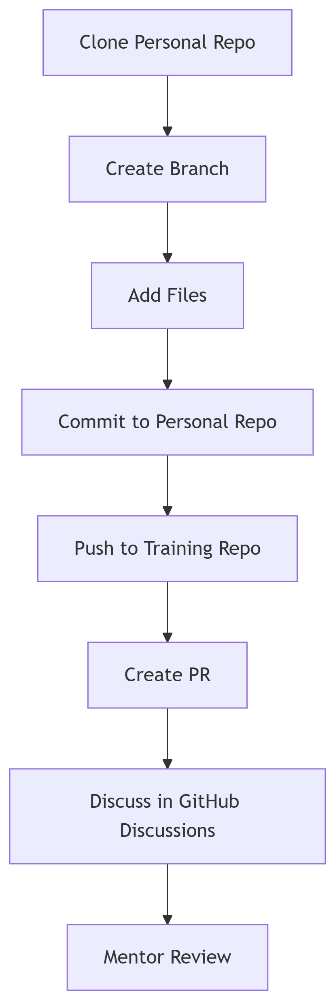

# ITasCode_DevOps_Cloud

```markdown



# Student Submission Guide

## 📌 How to Submit Your Daily Work

### 1️⃣ Work in Your Personal GitHub
```bash
# Clone your personal repo (create private repo if new)
git clone https://github.com/YOUR-USERNAME/devsecops-daily
cd devsecops-daily

# Create daily branch (replace values)
git checkout -b day1-topic-yourname

# Required files:
day1-topic/
├── notes.md          # Key learnings with examples
├── presentation.md   # 5-min summary with diagrams
└── proof/            # Code/screenshots/scan-results
    ├── main.tf
    └── output.png

# Save to your repo
git add .
git commit -m "Completed day1: topic"
git push origin day1-topic-yourname
```

### 2️⃣ Submit to Training Repo
```bash
# Connect to training repo (one-time setup)
git remote add training https://github.com/ITasCode/DevOps_Cloud.git

# Push your branch
git push training day1-topic-yourname:submissions/day1-yourname --force

# Create PR at:
# github.com/ITasCode/DevOps_Cloud/compare
```

## 🚦 Submission Rules
1. Branch name format: `dayX-topic-username` (lowercase)
2. Every submission must include:
   - Notes with minimum 5 key points
   - Presentation-ready summary
   - Executable proof of work

## 💬 Team Communication Policy
All discussions must happen through GitHub Discussions:

For technical help:
Start a discussion in our Q&A category
Tag relevant mentors (@mentor-username)

  
## Never share:

Credentials
Personal data
Client-specific code


## ⚠️ Important Rules
Branch naming: dayX-topic-username (lowercase)

Minimum requirements per submission:
Every submission must include:
   - Notes with minimum 5 key points
   - Presentation-ready summary
   - Executable proof of work


Pro Tip: Use git commit --amend to improve your last commit before pushing
